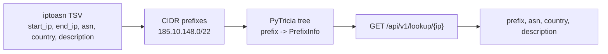

# LPM Toolkit

API for **IP-to-ASN lookups.**

Give the service an IP address, and it finds the most specific network prefix
that contains it:

```text
185.10.149.1 -> 185.10.148.0/22 -> ASN 197558, DE, MUTH
```


## Why

External IP intelligence APIs are fine for one-off lookups. They are painful for
batch or stream processing:

- each IP costs a network round trip;
- large jobs can hit rate limits;
- request time depends on another service;
- the same ranges are checked again and again.

This project does the slow part once: fetch the dataset, build a prefix tree,
and keep request-time lookup local.

## How It Works

`lpm-toolkit` downloads the public `iptoasn` TSV dataset, converts IP ranges to
CIDR prefixes, builds an in-memory PyTricia tree, and serves local IP-to-ASN
lookups over HTTP.



Prefix tree gives the important bit:

- do not expand ranges into every individual IP;
- do not scan all prefixes for every lookup;
- longest prefix match returns the best matching network.

## Example

Source TSV row:

```text
185.10.148.0    185.10.151.255    197558    DE    MUTH
```

```text
185.10.148.0 - 185.10.151.255 -> 185.10.148.0/22
"185.10.148.0/22" -> PrefixInfo(asn=197558, country="DE", description="MUTH")
```

## Quick Start

Update the repo, set an API token, and run the Docker stack:

```bash
git pull
export API_TOKEN=my-secret-token
make build
make up
```

The first start may take a little longer while the dataset is downloaded and
cached.

Open Swagger UI:

```text
http://127.0.0.1:8000/docs
```

Stop:

```bash
make down
```

## API

`GET /api/v1/lookup/{ip}`

```bash
curl -H 'Authorization: Bearer my-secret-token' \
  http://127.0.0.1:8000/api/v1/lookup/8.8.8.8
```

```json
{
  "prefix": "8.8.8.0/24",
  "asn": 15169,
  "country": "US",
  "description": "GOOGLE"
}
```

Errors:

- `401 Unauthorized` for a missing or wrong token;
- `404 Not Found` when no prefix is found;
- `422 Unprocessable Entity` for an invalid IPv4 address.

## Configuration

| Variable | Required | Default |
| --- | --- | --- |
| `API_TOKEN` | yes | none |
| `IPTOASN_DATASET_PATH` | no | `data/ip2asn-v4.tsv.gz` |
| `IPTOASN_DATASET_URL` | no | `https://iptoasn.com/data/ip2asn-v4.tsv.gz` |
| `IPTOASN_DOWNLOAD_TIMEOUT` | no | `30` |
