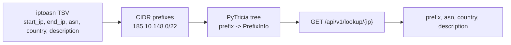

# LPM Toolkit

**Longest Prefix Match for local IP-to-ASN lookups.**

Give the service an IP address, and it finds the most specific network prefix
that contains it:

```text
185.10.149.1 -> 185.10.148.0/22 -> ASN 197558, DE, MUTH
```

`lpm-toolkit` downloads the public `iptoasn` TSV dataset, converts IP ranges to
CIDR prefixes, builds an in-memory PyTricia tree, and serves local IP-to-ASN
lookups over HTTP.

## Why

External IP intelligence APIs are fine for one-off lookups. They are painful for
batch or stream processing:

- each IP costs a network round trip;
- large jobs can hit rate limits;
- request time depends on another service;
- the same ranges are checked again and again.

This project does the slow part once: fetch the dataset, build a prefix tree,
and keep request-time lookup local.

## Data Flow



Prefix tree gives the important bit:

- do not expand ranges into every individual IP;
- do not scan all prefixes for every lookup;
- longest prefix match returns the best matching network.

## Example

Source TSV row:

```text
185.10.148.0    185.10.151.255    197558    DE    MUTH
```

```text
185.10.148.0 - 185.10.151.255 -> 185.10.148.0/22
"185.10.148.0/22" -> PrefixInfo(asn=197558, country="DE", description="MUTH")
```

## Run

The project is Docker-first.

```bash
make build
API_TOKEN=my-secret-token make up
```

On first start the app downloads the dataset to:

```text
data/ip2asn-v4.tsv.gz
```

Open Swagger UI:

```text
http://127.0.0.1:8000/docs
```

Stop:

```bash
make down
```

## API

`GET /api/v1/lookup/{ip}`

```bash
curl -H 'Authorization: Bearer my-secret-token' \
  http://127.0.0.1:8000/api/v1/lookup/8.8.8.8
```

```json
{
  "prefix": "8.8.8.0/24",
  "asn": 15169,
  "country": "US",
  "description": "GOOGLE"
}
```

Errors:

- `401 Unauthorized` for a missing or wrong token;
- `404 Not Found` when no prefix is found;
- `422 Unprocessable Entity` for an invalid IPv4 address.

## Configuration

| Variable | Required | Default |
| --- | --- | --- |
| `API_TOKEN` | yes | none |
| `IPTOASN_DATASET_PATH` | no | `data/ip2asn-v4.tsv.gz` |
| `IPTOASN_DATASET_URL` | no | `https://iptoasn.com/data/ip2asn-v4.tsv.gz` |
| `IPTOASN_DOWNLOAD_TIMEOUT` | no | `30` |

## Development

```bash
make build      # build Docker image
make up         # run API, requires API_TOKEN=...
make down       # stop API
make logs       # follow container logs
make lint       # run Ruff checks in Docker
make format     # format code with Ruff in Docker
make fix        # run Ruff autofixes in Docker
make test       # run tests in Docker
make smoke      # build tree and run one lookup in Docker
make check      # run lint and tests in Docker
make hooks      # install pre-commit git hook
make precommit  # run pre-commit hooks for all files
```

```text
app/
  main.py          FastAPI app setup and startup initialization
  dataset.py       Download/read iptoasn TSV and convert ranges to CIDRs
  domain.py        Domain models returned by the API
  repository.py    Prefix repository interface and PyTricia implementation
  api/v1/          API routes and auth dependency
tests/             Pipeline and auth tests
docs/demo/         README screenshots
```

## Demo


## Related Reading

This README uses the same high-level framing as
[Classifying Data Center IP Addresses with Radix Trees](https://paraxial.io/blog/cloud-ips):
fetch published IP ranges once, put them into a radix/patricia tree, and keep
request-time classification fast.
