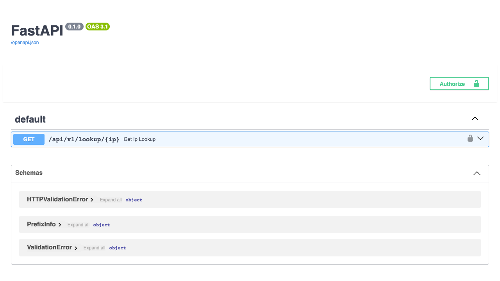
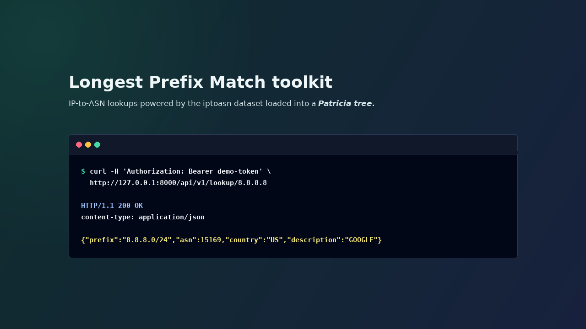

# LPM Toolkit: Longest Prefix Match for IP Lookups

**LPM = Longest Prefix Match.**

Given an IP address, this service finds the most specific network prefix that
contains it and returns ASN metadata.

`lpm-toolkit` turns a public IP range dataset into a small local lookup service.
It downloads the `iptoasn` TSV file, converts IP ranges into CIDR prefixes, puts
those prefixes into a PyTricia tree, and answers lookup requests from memory.

This is useful when a normal external IP intelligence API is too slow, too
expensive, or too easy to rate-limit for your workload.

## Why

Many APIs can tell you what ASN, country, or network description belongs to one
IP address. That works for occasional manual checks.

It does not work as well when you need to process thousands or millions of IPs:

- every lookup adds network latency;
- every lookup depends on an external service being available;
- large batches can hit provider rate limits;
- repeated lookups for common IP ranges waste time.

This project keeps the dataset locally and performs longest prefix match in
memory. The result is a tiny local database optimized for IP prefix lookups.

The core idea is the same one used in systems that classify cloud or data-center
IPs from provider-published ranges: do the slow dataset fetch once, build a
prefix-aware data structure, and keep request-time lookup cheap.

## What It Does

Input dataset row:

```text
185.10.148.0    185.10.151.255    197558    DE    MUTH
```

The row is converted into CIDR prefixes:

```text
185.10.148.0 - 185.10.151.255 -> 185.10.148.0/22
```

Each prefix is stored in a PyTricia tree:

```text
key   = "185.10.148.0/22"
value = PrefixInfo(prefix="185.10.148.0/22", asn=197558, country="DE", description="MUTH")
```

At request time, the API receives an IPv4 address and returns the most specific
matching prefix:

```text
185.10.149.1 -> 185.10.148.0/22 -> ASN 197558, DE, MUTH
```

No external API call is made per lookup.

## How It Works

```text
startup
  -> ensure data/ip2asn-v4.tsv.gz exists
  -> download it from iptoasn if missing
  -> read TSV rows
  -> convert start/end IP ranges to CIDR prefixes
  -> add prefixes to PyTricia
  -> serve /api/v1/lookup/{ip}
```

Why a prefix tree:

- storing every individual IP from a range can explode memory usage;
- scanning all prefixes for every request is linear work;
- IP prefixes naturally map to a radix/patricia trie;
- longest prefix match returns the best matching network for a given IP.

Current scope:

- IPv4 only;
- in-memory lookup tree;
- dataset is downloaded on startup only when the local file is missing;
- one API endpoint for IP lookup.

## Demo

Swagger UI exposes the protected lookup endpoint:



Lookup response example:



## Quick Start

The project is Docker-first.

Build the image:

```bash
make build
```

Run the API:

```bash
API_TOKEN=my-secret-token make up
```

On first start the app downloads the dataset into:

```text
data/ip2asn-v4.tsv.gz
```

The `data/` directory is mounted into the container, so the dataset is reused on
the next run.

Open the API docs:

```text
http://127.0.0.1:8000/docs
```

Stop the API:

```bash
make down
```

## API

### `GET /api/v1/lookup/{ip}`

Looks up one IPv4 address and returns the matched prefix metadata.

Authentication:

```http
Authorization: Bearer my-secret-token
```

Example:

```bash
curl -H 'Authorization: Bearer my-secret-token' \
  http://127.0.0.1:8000/api/v1/lookup/8.8.8.8
```

Response:

```json
{
  "prefix": "8.8.8.0/24",
  "asn": 15169,
  "country": "US",
  "description": "GOOGLE"
}
```

Another example:

```bash
curl -H 'Authorization: Bearer my-secret-token' \
  http://127.0.0.1:8000/api/v1/lookup/185.10.149.1
```

```json
{
  "prefix": "185.10.148.0/22",
  "asn": 197558,
  "country": "DE",
  "description": "MUTH"
}
```

Possible errors:

- `422 Unprocessable Entity` for an invalid IPv4 path parameter;
- `401 Unauthorized` for a missing or wrong token;
- `404 Not Found` when no prefix is found.

## Configuration

| Variable | Required | Default | Description |
| --- | --- | --- | --- |
| `API_TOKEN` | yes | none | Bearer token required by the API |
| `IPTOASN_DATASET_PATH` | no | `data/ip2asn-v4.tsv.gz` | Local dataset cache path |
| `IPTOASN_DATASET_URL` | no | `https://iptoasn.com/data/ip2asn-v4.tsv.gz` | Dataset URL |
| `IPTOASN_DOWNLOAD_TIMEOUT` | no | `30` | Dataset download timeout in seconds |

## Commands

```bash
make build     # build Docker image
make up        # run API, requires API_TOKEN=...
make down      # stop API
make logs      # follow container logs
make lint      # run Ruff checks in Docker
make format    # format code with Ruff in Docker
make fix       # run Ruff autofixes in Docker
make test      # run tests in Docker
make smoke     # build tree and run one lookup in Docker
make check     # run lint and tests in Docker
make hooks     # install pre-commit git hook
make precommit # run pre-commit hooks for all files
```

`pre-commit` itself is installed on the host, but the configured hooks run Ruff
inside Docker Compose:

```bash
python -m pip install pre-commit
make hooks
```

## Project Layout

```text
app/
  main.py          FastAPI app setup and startup initialization
  dataset.py       Download/read iptoasn TSV and convert ranges to CIDRs
  domain.py        Domain models returned by the API
  repository.py    Prefix repository interface and PyTricia implementation
  api/v1/          API routes and auth dependency
tests/             Pipeline and auth tests
docs/demo/         README screenshots
```

## Development Notes

The repository hides the PyTricia details behind a small interface:

```python
repository.add(prefix_info)
repository.get("8.8.8.8")
```

The API layer receives a typed `IPv4Address` path parameter and returns the
domain model directly. FastAPI uses the `PrefixInfo` response model to generate
the OpenAPI schema.

Run the full local check before pushing:

```bash
make check
```

## Related Reading

The README explanation borrows the high-level problem framing from
[Classifying Data Center IP Addresses with Radix Trees](https://paraxial.io/blog/cloud-ips):
fetch published IP ranges once, store them in a radix/patricia tree, and keep
request-time classification fast.
